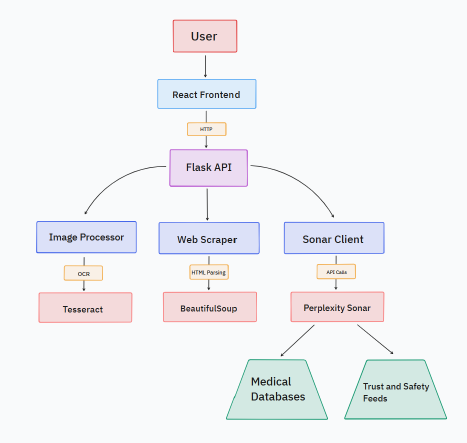

# Aethon: AI Fraud Detection System
An intelligent fraud detection system powered by Perplexity's Sonar API, designed to detect fraudulent prescriptions and fake online reviews through advanced AI analysis.

### Features
- Prescription Fraud Detection: Identifies forged or medically unsafe prescriptions
- Review Authenticity Analysis: Detects fake reviews and astroturfing in online content
- Multi-Modal Input Support:
  - Image upload and webcam capture for prescriptions
  - URL parsing for online reviews
  - Direct text input
- Real-time Analysis: Streaming API integration with detailed reasoning
- Intuitive UI: Clean, responsive interface with clear risk assessment visualization

## System Architecture
Aethon consists of two main components:
- Backend: Flask API server handling content processing and AI analysis
- Frontend: Next.js application providing the user interface

For detailed architecture information, see [System Architecture Documentation](docs/System_Architecture.md).

## Quick Start
### Prerequisites
- Python 3.7+
- Node.js 18+

See the [pyproject.toml](backend/pyproject.toml) and [package.json](frontend/package.json) files for dependencies.

## Usage
1. Navigate to the homepage
2. Click "Start Verification"
3. Choose verification method:
   - Prescription Verification: Upload an image or take a photo
   - Online Review Analysis: Enter a URL
4. Review the fraud analysis results

## API Reference
The backend exposes the following endpoints:

- `POST /analyse`: Analyses content for potential fraud
- `GET /status`: Checks API status
For detailed API documentation, see [API Reference](docs/API_Reference.md).

## Development Team
- Partha Khanna - [@parthak314](https://github.com/parthak314)
- Bhargav Shivakumar - [@bhargav-shivakumar](https://github.com/Bhargav-Shivakumar)

## Future Development
- Support for additional content types (audio, video)
- Enhanced fraud detection heuristics
- Integration with healthcare databases
- RAG system trained on prescription datasets (Kaggle: Illegible Medical Prescription Images)
- Mobile application support
- Login and subscription feature
- End to end encryption 
- Improved UI
