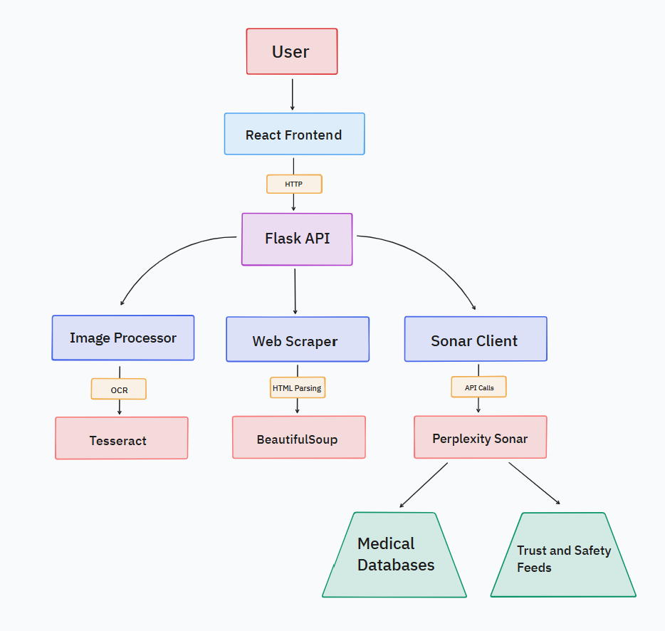

# System Architecture

## Component Breakdown
### 1. Frontend (React)
- Responsibility: User interaction and result visualization
- Key Features:
    - Image upload/webcam capture
    - URL/text input forms
    - Fraud analysis dashboard
- Tech Stack: React, Next.js, TailwindCSS

### 2. Backend API (Python/Flask)
- Endpoints:
    - `/analyse`: Core fraud detection endpoint
    - `/status`: System monitoring
- Key Responsibilities:
    - Input validation and routing
    - Error handling
    - Response formatting

### 3. Processing Modules
| Module            | Technology                     | Function                                                   |
|-------------------|--------------------------------|------------------------------------------------------------|
| Image Processor    | OpenCV, Tesseract              | Image enhancement, signature redaction, OCR text extraction|
| Web Scraper        | BeautifulSoup, Requests        | Content extraction, robots.txt compliance, anti-bot bypass |
| Sonar Client       | OpenAI SDK                     | Perplexity API integration, multimodal analysis, fraud heuristics|

### 4. Perplexity Sonar Integration
- Key Capabilities:
    - Real-time internet search for verification
    - Chain-of-thought reasoning
    - Source citation

- Model Specialization:
    - sonar-pro-chat: Medical prescription analysis
    - sonar-pro: Reviews/article analysis

- Data Flow:
    - Receive processed content from backend
    - Perform deep research with citations
    - Generate fraud probability score
    - Return structured reasoning

### 5. Fraud Detection Engine

## Data Flow
1. Input Phase: User submits content via web interface
2. Processing Phase:
    - Images → Enhancement → OCR → Text
    - URLs → Scraping → Content sanitization
3. Analysis Phase:
    - Text payload sent to Sonar API
    - Image data sent as base64 with text context
4. Decision Phase:
    - Keyword-based fraud detection
    - Confidence scoring
5. Output Phase: Structured JSON response to client

## Security Features
- Base64 input sanitization
- URL domain validation
- OCR-based PII redaction
- Rate limiting (Redis?)
- HTTPS enforcement
